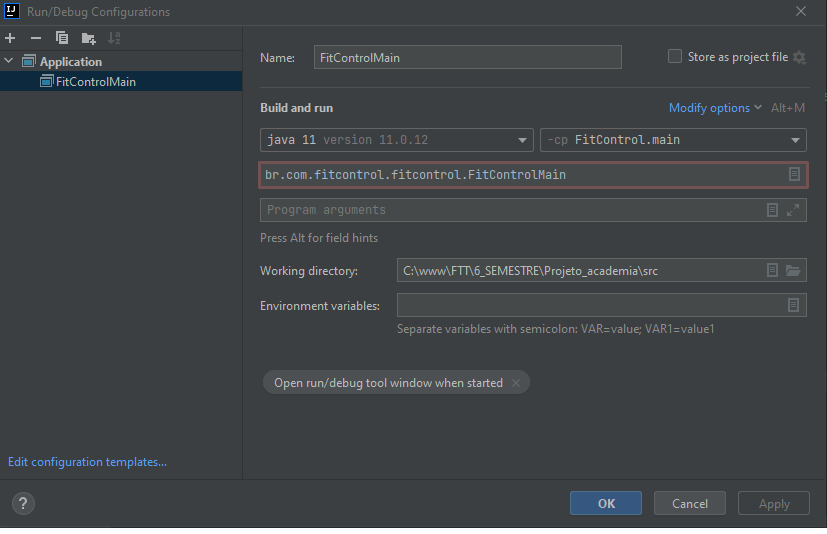

## Projeto Fit Control
<h5>Software de gerenciamento e controle de acesso para academias de pequeno porte<h5><br/>

<!--te-->

### Features

- [x] Cadastro de alunos
- [x] Cadastro de Funcionários
- [x] Cadastro de recompensas
- [x] Comunicação com catraca
- [x] Software desktop com interface gráfica
- [x] Emissão de relatórios em CSV


#### 🛠 Caracteristicas do sistema 🛠
* CRUD 
* Modelo de arquitetura 3 camadas (MVC)
* Acesso aos dados via banco de dados
* A camada de negócio possui interfaces expostas e documentadas
* A camada de interface com JavaFX


 #### 🔌 Comunicação Serial  💻 

##### Estrutura Protocolo

Abaixo é apresentado a estrutura do protocolo de comunicação da catraca

 <table>
    <tr>
      <td>STX</td>
      <td>FUNÇÃO</td>
      <td>DADOS</td>
      <td>ETX</td>
    </tr>
    <tr>
      <td>0x02</td>
      <td>0xXX</td>
      <td>0xXX 0xXX 0xXX 0xXX</td>
      <td>0x03</td>
    </tr>
 </table>

##### Funções

###### Evento de Check In

Indica a entrada de um cliente na loja através da catraca

<table>
 <tr>
      <th>STX</th>
      <th>FUNÇÃO</th>
      <th colspan="2">DADOS</th>
      <th>ETX</th>
    </tr>
    <tr>
      <td>0x02</td>
      <td>0x00</td>
      <td>ID Catraca</td>
      <td>ID Usuário</td>
      <td>0x03</td>
    </tr>
</table>


###### Evento de Check Out

Indica a saída de um cliente na loja através da catraca

<table>
 <tr>
      <th>STX</th>
      <th>FUNÇÃO</th>
      <th colspan="2">DADOS</th>
      <th>ETX</th>
    </tr>
    <tr>
      <td>0x02</td>
      <td>0x01</td>
      <td>ID Catraca</td>
      <td>ID Usuário</td>
      <td>0x03</td>
    </tr>
</table>

###### Evento de Erro

Indica algum erro causado ocorrido na catraca

<table>
 <tr>
      <th>STX</th>
      <th>FUNÇÃO</th>
      <th colspan="2">DADOS</th>
      <th>ETX</th>
    </tr>
    <tr>
      <td>0x02</td>
      <td>0x02</td>
      <td>ID Catraca</td>
      <td>Cód Erro</td>
      <td>0x03</td>
    </tr>
</table>

###### Forçar Liberação de Catraca

Força a liberação da catraca

<table>
 <tr>
      <th>STX</th>
      <th>FUNÇÃO</th>
      <th>DADOS</th>
      <th>ETX</th>
    </tr>
    <tr>
      <td>0x02</td>
      <td>0x03</td>
      <td>ID Catraca</td>
      <td>0x03</td>
    </tr>
</table>


###### Bloquear Catraca

Bloqueia a Catraca

<table>
 <tr>
      <th>STX</th>
      <th>FUNÇÃO</th>
      <th>DADOS</th>
      <th>ETX</th>
    </tr>
    <tr>
      <td>0x02</td>
      <td>0x04</td>
      <td>ID Catraca</td>
      <td>0x03</td>
    </tr>
</table>

###### Desbloquear Catraca

Desbloqueia a Catraca

<table>
 <tr>
      <th>STX</th>
      <th>FUNÇÃO</th>
      <th>DADOS</th>
      <th>ETX</th>
    </tr>
    <tr>
      <td>0x02</td>
      <td>0x05</td>
      <td>ID Catraca</td>
      <td>0x03</td>
    </tr>
</table>

 ### ⚠️ Sobre o desenvolvimento ⚠️

- Plataforma utilizada : Intellj
- Versão Java: 11.0.2

### Configurar ambiente ⛏⛏

A figura abaixo exibe como deve ser configurado o IntelliJ


### Configurar Banco de Dados  🎲  🪑

Para configurar o banco de dados é necessário criar duas variaveis de ambiente sendo


```
  FIT_CONTROL_DB_USER = "sua credencial de acesso";
  FIT_CONTROL_DB_PSW = "sua senha";
```

Caso o banco não tenha sido criado, execute esse [arquivo](./MySQL/CriaBancoFitControl.sql)

### Entregas 💪😎

- [Video de apresentação](https://youtu.be/LIOv_CFsBhI)

- [Pitch](https://www.youtube.com/watch?v=MOzfB_MDtQE)

- [Manual](./docs/mDocs/Guia do Usuário.pdf)


💻 ## Desenvolvedores

<table>
    <tr>
        <td>Yago Caetano</td>
        <td>RA: 081190027</td>
				<td>https://github.com/Yago-Caetano</td>
    </tr>
    <tr>
        <td>Rodrigo Emiliano</td>
        <td>RA: 081190004</td>
				<td>https://github.com/RodrigoEmiliano27</td>
    </tr>
    <tr>
        <td>Guilherme Tavares</td>
        <td>RA: 081190035</td>
				<td>https://github.com/guiTavares13</td>
    </tr>
    <tr>
        <td>Roger kenich</td>
        <td>RA: 081190026</td>
				<td>https://github.com/RogerKenichi</td>
    </tr>
    <tr>
        <td>Lucas Santos</td>
        <td>RA: 081190015</td>
				<td>https://github.com/lucasscbr</td>
    </tr>
</table>
